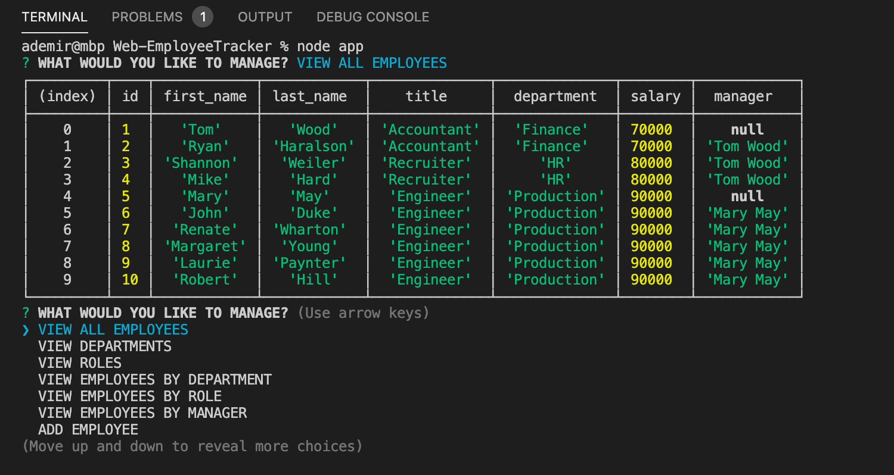
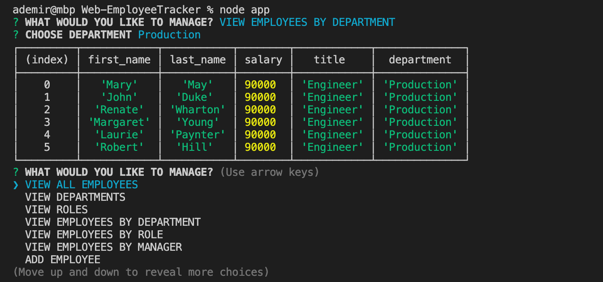

# EMPLOYEE TRACKER


## Description
This is a node.js CLI application integrated with mysql database. You can track employees,roles and departments. <br />
You can also update and remove items from database 
<br /> 

<br /> 
<br /> 

You can find the video of the app that shows functionality [here](./emptrack.webm) 


<br /> 



<br /> 

## User Story
```
As a business owner
I want to be able to view and manage the departments, roles, and employees in my company
So that I can organize and plan my business
```


## Installation
The following  dependencies must be installed to run the application: 
dependencies: mysql, inquirer, console.table

<br /> 
<br /> 

## Usage
​​* Fork repository and clone onto your machine
* You should have NODE installed and run the npm install command
* Using the MySQL workbench copy and paste the schema.sql file for the tables and the seed.sql to insert data.
* In the app.js file enter your database credentials
* To start the application type "node app.js" into the command line  and run.

## License
This project is license under the MIT license.


<br /> 

My GitHub username: [alidemirbay](https://github.com/alidemirbay)
<br />
You can ask your questions at: alidemirbay@gmail.com